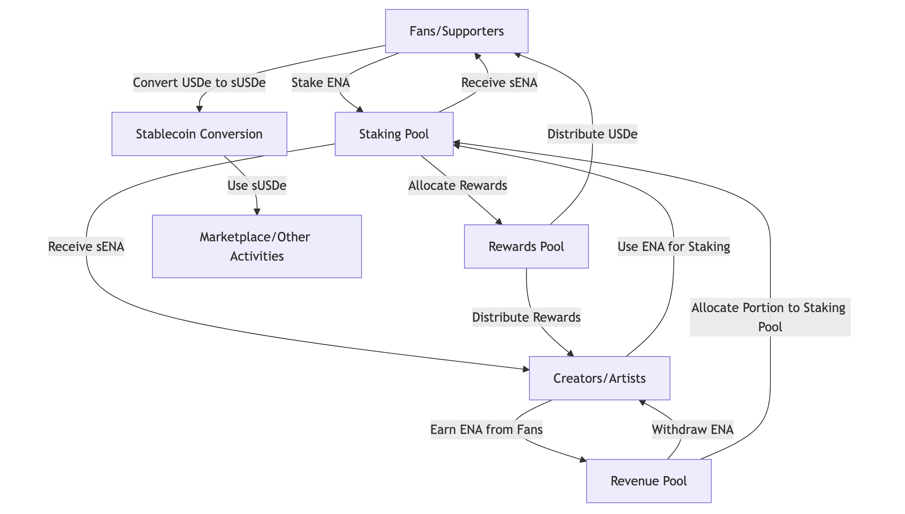
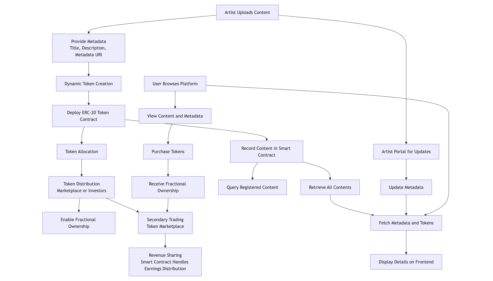

# Katana - Decentralized content fractionalization platform built on Ethena.

## Table of Contents
- [Introduction](#introduction)
- [Features](#features)
- [How It Works](#how-it-works)
- [Smart Contract Details](#smart-contract-details)
- [Technology Stack](#technology-stack)
- [Getting Started](#getting-started)
  - [Prerequisites](#prerequisites)
  - [Installation](#installation)
  - [Deployment](#deployment)
- [Usage](#usage)
- [Roadmap](#roadmap)
- [Contributing](#contributing)
- [License](#license)

---

## Introduction

The Decentralized Content Fractionalization Platform enables artists to tokenize their creative works, turning them into fungible tokens. These tokens allow for fractional ownership and seamless trading, empowering artists with new revenue streams while ensuring transparency and traceability on the blockchain.

Whether you're a digital artist, musician, or filmmaker, this platform allows you to engage your audience by offering shared ownership of your creations.

## Why Ethena and sUSDe Are Perfect for This Platform
### The Perks of Ethena
Ethena brings a robust and scalable ecosystem that perfectly complements our vision of creating a decentralized platform for fractionalized content ownership. Here's how:

- Cutting-Edge Technology: Ethena's blockchain infrastructure offers unparalleled transaction speed and low fees, ensuring seamless user experiences for creators and fans.
- High Security: Built on advanced cryptographic principles, Ethena provides a safe and tamper-proof environment for managing content ownership and tokenization.
- Developer-Friendly: Ethena’s ecosystem offers versatile tools and SDKs that allow us to rapidly innovate and deploy features tailored to our platform's needs.
### The Role of sUSDe
sUSDe, as Ethena's stablecoin, is the ideal financial backbone for our project:

- Stability and Accessibility: By pegging to a stable value, sUSDe ensures fans and creators avoid volatility risks, fostering trust in the system.
- Facilitating Microtransactions: sUSDe is perfect for enabling small-scale investments, such as buying fractions of a song, artwork, or video content.
- Liquidity Options: The stablecoin integration enhances the platform's liquidity pools, paving the way for secondary market activities like trading and profit-sharing.
- A Revenue Stream for Creators and Fans
Our partnership with Ethena and adoption of sUSDe create unique opportunities for both creators and fans:

- ### Creators:

Creators can tokenize their works into fungible assets, enabling direct monetization while retaining creative control.
Through secondary sales and royalties, creators enjoy a consistent revenue stream as their content gains value over time.
Fans and Investors:

Fans can invest in their favorite content, gaining a share of its financial success while fostering deeper connections with creators.
The potential appreciation of fractionalized tokens represents a new, exciting revenue stream for investors.
The Bigger Picture: Synergy and Growth
With sUSDe as a medium of exchange and Ethena's ecosystem as the foundation, the platform enables a vibrant, decentralized creator economy.
This synergy not only empowers creators but also opens doors for fans to turn their passion into profit, strengthening community engagement and fostering sustainable growth.
By integrating Ethena and sUSDe, our platform is poised to redefine how creators monetize their work and how fans participate in the creative economy. This partnership paves the way for a win-win ecosystem built on trust, innovation, and mutual benefit.

---

## Features
The flowchart illustrates the overall process of the platform:

- **Dynamic Token Deployment**  
  Artists can upload content, and the platform automatically creates a new token contract with customizable parameters such as total supply, metadata, and ownership.

- **Fractional Ownership**  
  Each piece of content is represented by fungible tokens, allowing investors and fans to own fractions of the work.

- **Secure Metadata Storage**  
  Metadata such as title, description, and URI are securely stored and associated with each token.

- **Decentralized and Transparent**  
  Built on blockchain technology to ensure trustless and immutable operations.

---

## How It Works

1. **Artist Uploads Content:**  
   The artist uploads their work and provides details such as title, description, and total supply.

2. **Dynamic Token Creation:**  
   A new ERC-20 token contract is dynamically deployed, representing fractional ownership of the uploaded content.

3. **Token Distribution:**  
   The tokens are distributed to investors or sold in a marketplace, enabling fractional ownership.

4. **Earnings Distribution:**  
   Earnings from the sale or trade of tokens are routed back to the artist through the smart contract.

---

## Smart Contract Details

The main contract, `Main.sol`, handles the following key functionalities:
- **Create Content:**  
  Allows artists to register content and deploy a corresponding token contract.

- **Retrieve All Content:**  
  Provides a list of all registered content with associated metadata.

- **Fractional Token Contracts:**  
  Dynamically deployed ERC-20 contracts for each content uploaded.

Deployed contract: https://testnet.explorer.ethena.fi/address/0x86C41594e9aDeCcf8c85ba9EEe0138C7c9E70dBc

### Technology Stack
- Solidity: For writing the smart contracts.
- Hardhat: For development, testing, and deployment of smart contracts.
- Node.js: Backend and script integration.
- Ble-Testnet: Blockchain network for contract deployment and interaction.
- IPFS/Arweave: For decentralized metadata storage.

## Usage
Interact with the Contracts
- Create Content: Artists can register content and deploy token contracts using the platform's frontend or via direct interaction with the smart contract.

- Query Content: Use the getAllContents function to retrieve details of all registered content.

- Token Distribution: Once tokens are deployed, they can be distributed or traded on compatible marketplaces.

## License
----------

## Contact
For inquiries or support, reach out to us at:

Email: successaje7@gmail.com
Website: [Katana](https://katana-hazel.vercel.app/)

